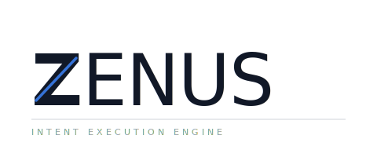
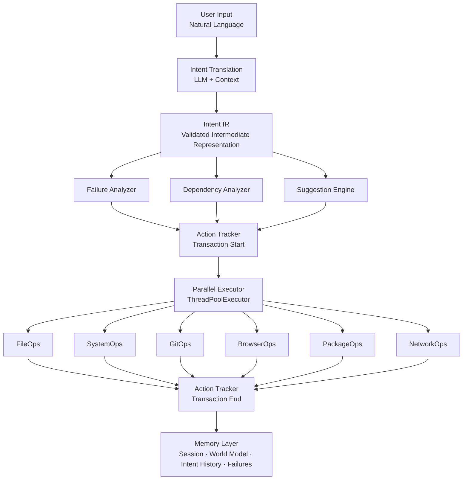
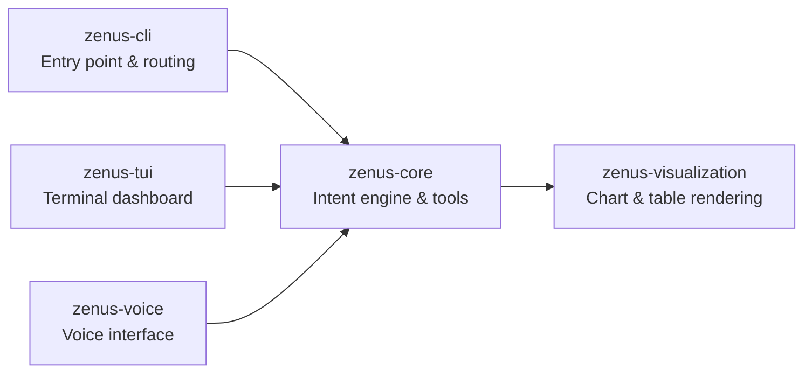

<div align="center">
  <picture>
    <source media="(prefers-color-scheme: dark)"  srcset="assets/wordmark-dark.svg">
    <source media="(prefers-color-scheme: light)" srcset="assets/wordmark.svg">
    
  </picture>

  <br/>

  [](CHANGELOG.md)
  [](LICENSE)
  [](https://python.org)
  [](docs/TEST_COVERAGE.md)
</div>

---

**A natural language shell for Linux — where you describe what you want, and the system does it safely.**

Zenus is not a coding assistant. It is a system operations layer: you tell it what you need done, it plans the safest way to do it, and every action is tracked so mistakes can be undone. It runs today on any Linux machine.

```bash
$ zenus "organize my downloads by file type"
✓ Moved 47 files into 5 categories

$ zenus "show me what's using the most CPU"
/home/user — Top 5 processes displayed

$ zenus rollback
✓ Rolled back: moved 47 files back to ~/Downloads
```

```bash
zenus > what's the latest stable version of Node.js?
  Node.js 22.14.0 (LTS) was released on 2025-02-11.
  Next LTS line (v24) is expected in October 2025.

zenus > install it
  [CREATE] Step 1: package.install (node, nodejs) ...
  ✓ Installed Node.js 22.14.0
```

---

## Why Zenus?

Most AI tools in the terminal are coding assistants — they read your files, generate code, and open pull requests. Zenus solves a different problem: **operating your system**. File management, process control, service administration, package installs, git workflows, network operations — the day-to-day work of running a Linux machine.

Three things make Zenus different:

**1. Intent IR — a typed contract between the LLM and your system.**
Every command the LLM produces is validated against a strict schema before anything executes. No raw text ever reaches your shell. The schema encodes risk levels, required confirmations, and step dependencies. This is not a convenience — it is the architectural foundation for safe, auditable, eventually OS-grade execution.

**2. Transaction-based rollback for system operations.**
`zenus rollback` is not `git undo`. It undoes file moves, package installs, service restarts, and process kills — not just source code. Every operation is recorded as a reversible transaction before it runs.

**3. Open source, local-first, multi-LLM.**
Zenus works with Anthropic Claude, OpenAI, DeepSeek, and local models via Ollama. No vendor lock-in, no cloud dependency, no data sent anywhere you don't choose.

---

## The Long-Term Vision

Zenus is designed with a clear destination: **become an operating system**.

Today, Zenus is a Python layer running on Linux. The long-term architecture moves the AI intent layer closer to the hardware — where scheduling, memory management, and system policy are all mediated through intent rather than traditional syscalls. Every design decision made now (IntentIR, sandboxed execution, privilege tiers, the knowledge graph) is made with that future in mind.

**v1.2.0 is the foundation** — a production-ready system shell you can use today. The OS is where we are going, not where we are. See [ROADMAP.md](ROADMAP.md) for the full phased plan and [MANIFESTO.md](MANIFESTO.md) for the philosophy behind it.

The current release is **v1.2.0**, running on any Linux machine today.

---

## How It Works



**Key components:**

- **Intent IR** — Every LLM output is validated against a typed schema before execution. No raw text is ever executed. This is the contract that makes Zenus safe and auditable, and the foundation for OS-grade determinism.
- **Failure Analyzer** — Warns before repeating known failures and suggests fixes based on past experience.
- **Dependency Analyzer** — Builds a dependency graph so independent operations can run concurrently.
- **Suggestion Engine** — Proactively recommends optimizations (e.g. wildcards instead of 15 individual files).
- **Action Tracker** — Records every operation as a transaction, enabling rollback.
- **Parallel Executor** — Runs independent steps concurrently via ThreadPoolExecutor.
- **Memory Layer** — Three layers with different lifetimes: session (RAM), world model (disk), intent history (permanent audit trail).

---

## Packages

Zenus is a monorepo. Each package has a defined role and maps to a component in the future OS architecture.



| Package | Description | Future OS Role |
|---------|-------------|----------------|
| `zenus-core` | Intent translation, planning, tool execution, memory, safety | Kernel cognitive layer |
| `zenus-cli` | CLI entry point, argument routing, interactive REPL | System shell |
| `zenus-tui` | Terminal dashboard with execution log, history, memory view | Primary UI surface |
| `zenus-voice` | Speech-to-text and text-to-speech interface | Voice I/O subsystem |
| `zenus-visualization` | Automatic chart and table rendering for command output | Output rendering layer |

---

## Features

### Safety and correctness

- **Intent IR validation** — LLM output is parsed into a typed schema before any execution happens. Malformed or unsafe intents are rejected at the boundary.
- **Dry-run mode** — Preview the full execution plan without running anything: `zenus --dry-run "delete all tmp files"`
- **Sandboxed execution** — Path validation, resource limits, and permission checks on every tool call.
- **Risk assessment** — Destructive operations are flagged before execution.
- **Undo/rollback** — Every operation is tracked as a transaction. `zenus rollback` reverses the last action; `zenus rollback 5` reverses the last five.

### Execution

- **Parallel execution** — Independent operations are automatically detected and run concurrently (2–5x faster for batch work).
- **Background task queue** — Long-running operations can be submitted as background tasks with priority scheduling (HIGH/NORMAL/LOW), status tracking, and cancellation. No external broker required.
- **Async-native stack** — `Orchestrator.async_execute_command` and all LLM methods support `async/await` without blocking the event loop.
- **HTTP connection pooling** — Shared `urllib3.PoolManager` reuses TCP connections across tool HTTP calls, reducing latency and file-descriptor churn.
- **Adaptive retry** — Failed steps are retried with updated context from the failure observation.
- **Iterative mode** — For complex multi-step tasks, Zenus uses a ReAct loop: execute, observe, adapt.

### Intelligence

- **Failure learning** — Tracks failures in a local database and warns when a previously-failed operation is attempted again.
- **Contextual awareness** — Knows working directory, git status, system state, and recent history when constructing plans.
- **Optimization suggestions** — Detects inefficient patterns (e.g. processing 15 files individually) and suggests better approaches.
- **Tree of Thoughts** — For high-stakes decisions, explores multiple solution paths and selects the best one by evaluating confidence, risk, and speed.
- **Self-reflection** — Critiques its own plan before execution and revises if needed.
- **Goal inference** — Identifies implied steps the user didn't explicitly mention (e.g. adding a backup before a destructive migration).
- **LLM-classified web search** — The LLM decides when current data is needed (versions, scores, news) and searches automatically. Results are injected as context; you never need to ask Zenus to search.
- **Knowledge graph** — Builds a persistent, typed entity-relationship graph from every executed action. Enables impact analysis: "what would be affected if I remove this service?".

### Memory and caching

- **Session memory** — Maintains context within a conversation.
- **World model** — Learns persistent facts about your environment (frequent paths, preferred tools, project structure).
- **Intent history** — Complete audit trail of every operation.
- **Failure patterns** — Records what went wrong and what fixed it.
- **Intent cache** — LRU in-memory + disk cache with 1-hour TTL; repeated commands skip the LLM entirely (zero tokens, instant response).
- **Config hot-reload** — `config.yaml` changes are picked up at runtime without restarting; subsystems register callbacks to react to updates.
- **Vault-backed secrets** — Secrets can be sourced from HashiCorp Vault KV v2 in addition to `.env` files; Vault values win over env vars.

### Agentic harness (v1.2.0)

- **Hook pipeline** — Run shell callbacks before or after any tool action. Pre-hooks that exit non-zero deny execution. Post-hooks fire asynchronously. Patterns use fnmatch (`"FileOps.delete_file"`, `"*"`).
- **Plan mode** — `/plan` presents the full execution plan as a rich table and waits for your approval before any step runs. Auto-approves read-only plans when configured.
- **Skills registry** — User-extensible slash commands from `*.md` files with YAML front-matter. Bundled skills: `/commit`, `/review-pr`, `/simplify`, `/explain`, `/test-coverage`. Discovery: bundled → `~/.zenus/skills/` → `.zenus/skills/`.
- **Session store** — Persist and resume sessions at `~/.zenus/sessions/<id>.json` (owner-only). Auto-prune to `max_sessions`. `/session list/save/load/delete`.
- **Context compactor** — `/compact` summarises intent history via LLM. Auto-triggers when context hits the configurable threshold.
- **TaskOps** — Formal task lifecycle: `create`, `list`, `get`, `stop`, `output`, `purge`. Wraps the background queue with a user-visible, agent-addressable API. `/tasks` shell command.
- **ScheduleOps** — Register cron jobs from within an execution plan. Remote HTTP webhook triggers with URL scheme validation.
- **Git worktrees** — `WorktreeOps` creates isolated branches for risky work; auto-cleanup if no commits are made.
- **NotebookOps** — Read and edit Jupyter `.ipynb` cells without a kernel: list, read, edit, add, delete, clear outputs.
- **Developer tools** — `ToolSearch` (runtime registry search), `AskUserQuestion` (structured mid-plan user prompts), `SleepTool`, `/doctor` (10-check system health table), `/output-style`.

### Interoperability (v1.2.0)

- **MCP server** — `zenus mcp-server` exposes every tool action as an individual MCP tool (`FileOps__read_file`, etc.). Supports `stdio` transport (Claude Code, Cline, Continue) and `sse`. Privilege-gated: ShellOps/CodeExec excluded by default.
- **MCP client** — Connect to external MCP servers at startup; their tools appear as `mcp__{server}__{tool}` in the registry, transparently available to the orchestrator.

---

## Installation

### Snap (recommended for Linux desktop)

```bash
snap install --classic zenus
```

Or download from [GitHub Releases](https://github.com/Guillhermm/zenus/releases) and install locally:

```bash
snap install --classic --dangerous zenus_1.2.0_amd64.snap
```

### pip

```bash
pip install zenus-cli   # installs zenus and zenus-tui
```

### From source

```bash
git clone https://github.com/Guillhermm/zenus.git
cd zenus
./install.sh       # creates venv, installs packages, configures LLM, sets up aliases
source ~/.bashrc
zenus help
```

The source installer guides you through choosing an LLM backend:

| Backend | Cost | Notes |
|---------|------|-------|
| **Ollama** (local) | Free | Requires 4–16 GB RAM. Full privacy. |
| **Anthropic Claude** | ~$0.003/cmd | Best reasoning. claude-sonnet-4-6 recommended. |
| **DeepSeek** | ~$0.0003/cmd | Strong performance at low cost. |
| **OpenAI** | ~$0.001/cmd | gpt-4o and gpt-4.1 supported. |

### Updating (source install)

```bash
cd zenus && git pull && ./update.sh
```

---

## Usage

### Interactive shell

```bash
$ zenus
zenus > organize my downloads by file type
✓ Moved 47 files into 5 categories

zenus > show disk usage for my home directory
/home/user: 142 GB used / 500 GB total (28%)

zenus > exit
```

### Direct execution

```bash
zenus "list files in ~/Documents"
zenus --dry-run "delete all tmp files"
zenus --iterative "read my research paper and improve chapter 3"
```

### Rollback

```bash
zenus rollback          # Undo last action
zenus rollback 5        # Undo last 5 actions
zenus rollback --dry-run  # Preview what would be undone
```

### History

```bash
zenus history
zenus history --failures
```

### TUI

```bash
zenus-tui
```

---

## What Zenus Can Do

### File operations
- Organize, search, copy, move, read, write files
- Batch operations with wildcard optimization
- Content editing via natural language

### System management
- Disk usage, process monitoring, CPU/memory stats
- Start, stop, restart services
- Package management (apt, dnf, pacman)

### Developer workflows
- Git status, commit, branch, history
- Docker/Podman container management
- Browser automation (screenshot, download, scrape)

### Network
- Download files, ping, HTTP requests

---

## Project Structure

```
zenus/
├── packages/
│   ├── core/              # zenus-core: intent engine
│   │   └── src/zenus_core/
│   │       ├── orchestrator.py        # Main execution coordinator
│   │       ├── rollback.py            # Undo engine
│   │       ├── brain/                 # Intelligence layer
│   │       │   ├── llm/               # LLM adapters (Anthropic, OpenAI, DeepSeek, Ollama)
│   │       │   ├── planner.py
│   │       │   ├── failure_analyzer.py
│   │       │   ├── dependency_analyzer.py
│   │       │   ├── tree_of_thoughts.py
│   │       │   ├── prompt_evolution.py
│   │       │   ├── goal_inference.py
│   │       │   ├── self_reflection.py
│   │       │   └── multi_agent.py
│   │       ├── tools/                 # Tool implementations
│   │       │   ├── file_ops.py
│   │       │   ├── git_ops.py
│   │       │   ├── system_ops.py
│   │       │   ├── browser_ops.py
│   │       │   └── ... (10 tools total)
│   │       ├── memory/                # Session, world model, history
│   │       ├── shell/                 # Interactive shell
│   │       ├── execution/             # Parallel executor
│   │       ├── safety/                # Safety policies
│   │       ├── sandbox/               # Sandboxed execution
│   │       └── audit/                 # Audit logging
│   ├── cli/               # zenus-cli: entry point
│   ├── tui/               # zenus-tui: terminal dashboard
│   ├── voice/             # zenus-voice: voice interface
│   └── visualization/     # zenus-visualization: charts and tables
├── tests/
│   ├── unit/
│   └── integration/
├── docs/
├── config.yaml
└── install.sh
```

---

## Development

### Running tests

```bash
pytest
pytest --cov
pytest tests/unit/ -v
```

### Contributing

- Additional tool implementations
- LLM adapter improvements
- Test coverage
- Documentation

---

## Roadmap

See [ROADMAP.md](ROADMAP.md) for the full roadmap.

### What's working now (v1.2.0)
- Natural language → validated system operations (IntentIR contract)
- Transaction-based undo/rollback (`zenus rollback`)
- Dry-run mode — preview before any execution
- Parallel execution with automatic dependency analysis
- Failure learning and adaptive retry
- 10+ tool categories (files, git, system, packages, network, browser…)
- Multi-LLM support (Anthropic, OpenAI, DeepSeek, Ollama/local)
- TUI dashboard, voice interface (STT), web search
- Self-reflection, Tree of Thoughts, goal inference, knowledge graph
- MCP server and client mode
- Full agentic harness: hooks, plan mode, skills, session store, NotebookOps, TaskOps, ScheduleOps, WorktreeOps

### Near-term
- Voice: TTS completion and conversational flow
- Parallel execution benchmarks and live progress visualization
- Per-step atomic checkpointing and crash recovery
- OpenTelemetry distributed trace export

### Long-term (toward Zenus as OS)
- Persistent world model across reboots
- Multi-user support with isolated contexts
- Custom Linux distribution
- Hardware abstraction layer
- Replace shell as primary system interface

---

## License

GNU General Public License v3 — see [LICENSE](LICENSE).

---

## Support

- **Issues**: [GitHub Issues](https://github.com/Guillhermm/zenus/issues)
- **Discussions**: [GitHub Discussions](https://github.com/Guillhermm/zenus/discussions)
- **Documentation**: [docs/](docs/)

---

*Zenus: computing driven by intent, not commands.*
