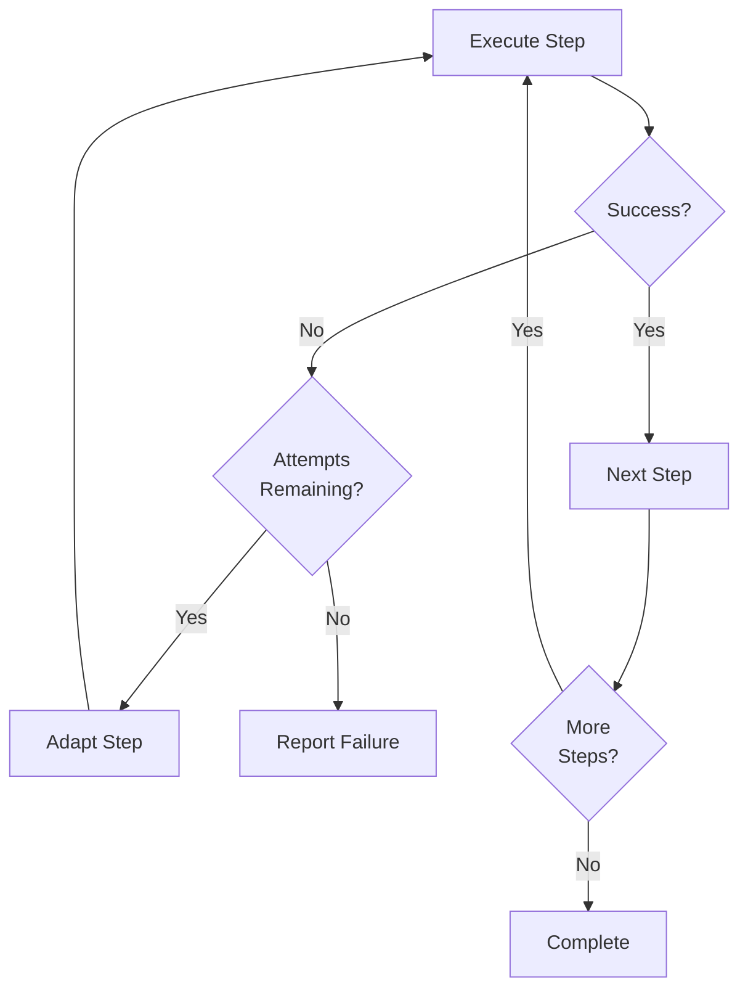

# Adaptive Execution

## Problem Statement

Basic execution executes a plan linearly:
```
Step 1 -> Step 2 -> Step 3
```

If Step 2 fails, the entire plan fails. No recovery, no learning.

## Adaptive Solution

Adaptive execution adds observation and retry:



## Key Features

### 1. Step-Level Retry
Each step can retry up to N times (default: 2) before failing.

### 2. Failure Observation
When a step fails:
- Capture the error
- Record execution context
- Attempt adaptation

### 3. Context-Aware Adaptation
Uses LLM to suggest corrective actions based on:
- Failed step details
- Error message
- Previous successful steps and known failure patterns

### 4. Execution History
Track all steps, attempts, and outcomes for:
- Debugging
- Learning
- User reporting

## Example Scenario

**Goal:** "Create a backup of my Documents folder"

**Plan:**
1. Check if backup directory exists
2. Create backup directory if needed
3. Copy files

**Without Adaptive Execution:**
```
Step 1: Check ~/Backups -> exists? No
Step 2: Create ~/Backups -> Permission denied
Plan FAILED
```

**With Adaptive Execution:**
```
Step 1: Check ~/Backups -> exists? No
Step 2: Create ~/Backups -> Permission denied
  Retry 1: Create ~/backup (lowercase) -> Success
Step 3: Copy files -> Success
Plan SUCCEEDED (1 step retried)
```

## Implementation Details

### ExecutionResult
```python
class ExecutionResult:
    success: bool
    output: str
    error: Optional[str]
```

### AdaptivePlanner
```python
class AdaptivePlanner:
    def execute_adaptive(intent, max_retries=2):
        for step in intent.steps:
            attempt = 0
            while attempt <= max_retries:
                result = execute_single_step(step)
                if result.success:
                    failure_analyzer.record_success(step)
                    break
                else:
                    failure_analyzer.record_failure(step, result.error)
                    adapted_step = llm_adapt_on_failure(step, result)
                    if adapted_step:
                        step = adapted_step
                    attempt += 1
```

## Current Capabilities

### Parallel Execution
Independent steps are automatically detected and run concurrently via `DependencyAnalyzer` + `ThreadPoolExecutor`:
```
Step 1 (scan Downloads) + Step 2 (scan Documents) -> parallel
Step 3 (merge results) -> depends on 1+2
```

### Failure Learning
The `FailureAnalyzer` tracks failures in a local database (`failures.db`) and:
- Warns before retrying a previously-failed operation
- Suggests fixes based on past recovery patterns
- Records successful adaptations for future reference

### Self-Reflection
Before execution, the planner critiques its own plan via a secondary LLM call and can revise steps that look risky or incomplete.

## Future Enhancements

### Deeper LLM-Based Correction
Extend adaptation to multi-turn correction loops where the LLM proposes, validates, and applies a sequence of corrective steps rather than a single retry.

### Distributed Execution
Run independent steps across worker processes or remote machines for large batch operations.

## Why This Matters

Adaptive execution is what makes Zenus feel autonomous instead of brittle.

**Basic planner:** "I tried and failed"
**Adaptive planner:** "I tried, it failed, I adapted, now it works"

This is the difference between a command executor and an intelligent agent.
